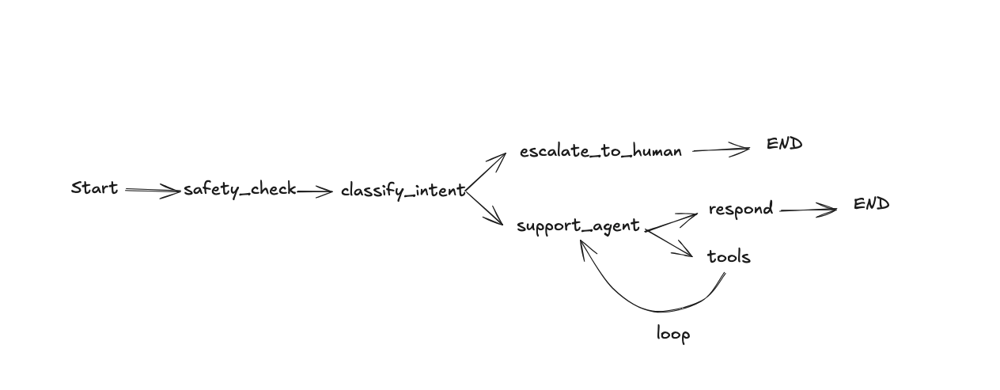

# TechGear Customer Support Agent

A production-grade AI customer support agent built with **LangChain**, **LangGraph**, and **OpenAI GPT-4o**. The agent autonomously handles the full support lifecycle — identifying customers, looking up orders, searching the knowledge base, issuing refunds, creating tickets, checking guardrails, and sending emails — while knowing when to escalate to a human.

---

## Architecture


---


## Graph structure



---

### Production patterns used

| Pattern | Implementation |
|---|---|
| **ReAct loop** | Agent reasons, calls tools, observes results, repeats |
| **Tool calling** | 13 `@tool` functions hitting real SQLite + FAISS + SMTP |
| **RAG** | FAISS vector search over support articles |
| **Human-in-the-loop** | Refunds > $50 require human approval |
| **Structured output** | `.with_structured_output()` for classification and evaluation |
| **Conditional edges** | Graph routes to escalation or support based on intent |
| **Memory** | `MemorySaver` checkpointer for conversation persistence |
| **Guardrails** | PII detection, prompt injection defense, action blocklist |
| **Observability** | LangSmith integration for tracing every decision |

---

## Project Structure

```
customer-support-agent/
│
├── src/
│   ├── agents/
│   │   ├── classifier.py        # Intent classification (structured output)
│   │   ├── support.py           # Main ReAct agent with .bind_tools()
│   │   ├── billing.py           # Refund evaluation with HITL gate
│   │   └── escalation.py        # Human handoff with context summary
│   ├── tools/
│   │   ├── customers.py         # Customer lookup (SQLite)
│   │   ├── orders.py            # Order status, history (SQLite)
│   │   ├── tickets.py           # Create/update/close tickets (SQLite)
│   │   ├── refunds.py           # Refund processing with guardrails (SQLite)
│   │   ├── knowledge.py         # RAG search (FAISS vector store)
│   │   └── email.py             # Email sending (SMTP or dev logging)
│   ├── models/
│   │   └── state.py             # WorkflowState + structured output models
│   ├── guardrails/
│   │   ├── permissions.py       # Refund thresholds, action blocklist
│   │   └── safety.py            # PII detection, prompt injection defense
│   ├── workflow/
│   │   ├── graph.py             # LangGraph StateGraph definition
│   │   ├── manager_actions.py   # The action to take when the manager approve/reject
│   │   └── runner.py            # Session management, graph invocation
│   ├── utils/
│   │   ├── config.py            # Centralised settings
│   │   ├── llm.py               # LLM/embedding factories
│   │   └── database.py          # SQLite schema + seed data
│   └── main.py                  # CLI entry point
│
├── api/
│   └── server.py                # FastAPI REST + WebSocket
│
├── ui/
│   └──── chat.py               # Streamlit chat interface for user
│   └──── manager.py            # Streamlit chat interface f  or manager view 
│
├── data/
│   ├── knowledge/               # Support articles (markdown)
│   ├── seed/                    # (optional) additional seed data
│   └── vectorstore/             # FAISS index (generated)
│
├── tests/
│   ├── test_tools.py            # Database tool tests
│   ├── test_classifier.py       # Intent classification tests
│   ├── test_guardrails.py       # Safety and permission tests
│   └── test_workflow.py         # End-to-end conversation tests
│
├── .github/workflows/
│   └── ci-cd.yml                 # CI/CD pipeline (lint, test, Docker)
│
├── Dockerfile
├── docker-compose.yml
├── requirements.txt
├── pyproject.toml               # Ruff linter config
├── .env.example
├── .gitignore
└── README.md
```

---

## Getting Started

### Prerequisites

- Python 3.11+
- OpenAI API key

### Installation

```bash
git clone https://github.com/zcoulibalyeng/customer-support-agent.git
cd customer-support-agent

python -m venv venv
source venv/bin/activate        # macOS/Linux
# venv\Scripts\activate         # Windows

pip install -r requirements.txt

cp .env.example .env
# Add your OPENAI_API_KEY to .env
```

### Run the CLI

```bash
# Interactive chat
python -m src.main

# Single message
python -m src.main --message "Where is my order ORD-1001?" --email alice@example.com
```

### Run the API

```bash
uvicorn api.server:app --reload --port 8000

# Create session
curl http://localhost:8000/chat/session

# Send message
curl -X POST http://localhost:8000/chat \
  -H "Content-Type: application/json" \
  -d '{"message": "Where is my order?", "thread_id": "<session_id>"}'
```

API docs: `http://localhost:8000/docs`

### Run the Chat UI

```bash
streamlit run ui/chat.py

Open another terminal

streamlit run ui/manager.py
```

### Run with Docker

```bash
docker-compose up --build -d             -> build the container
UI         -> http://localhost:8501      
Manager UI -> http://localhost:8502/
API docs     -> http://localhost:8000/docs

docker-compose down --rmi all            -> To delete the container
```

---

## Running Tests

```bash
# Unit tests (no API key needed)
python -m tests.test_guardrails
python -m tests.test_tools

# Integration tests (requires API key)
python -m tests.test_classifier
python -m tests.test_workflow
```

---

## Test Customers

The database is seeded with test data you can use immediately:

| Email | Name | Plan | Orders |
|---|---|---|---|
| alice@example.com | Alice Johnson | Premium | ORD-1001, ORD-1002 |
| bob@example.com | Bob Smith | Free | ORD-1003, ORD-1004 |
| carol@example.com | Carol Davis | Premium | ORD-1005 |
| dan@example.com | Dan Wilson | Free | ORD-1006 |
| eve@example.com | Eve Martinez | Premium | ORD-1007, ORD-1008 |

---

## Configuration

| Variable | Default | Description |
|---|---|---|
| `OPENAI_API_KEY` | *(required)* | OpenAI API key |
| `LLM_MODEL` | `gpt-4o` | Chat model |
| `LLM_TEMPERATURE` | `0` | Temperature |
| `EMBEDDING_MODEL` | `text-embedding-3-small` | Embedding model for RAG |
| `MAX_AUTO_REFUND` | `50.00` | Max refund without human approval |
| `SMTP_HOST` | *(empty)* | SMTP server (blank = dev logging) |
| `LANGCHAIN_TRACING_V2` | `false` | Enable LangSmith tracing |

---

## NB:

To enhance the realism of the simulation, I have integrated a Manager Dashboard and corresponding HITL (Human-in-the-Loop) actions. This interface demonstrates the approval workflow from the manager's perspective. Note: Real email notifications are currently commented out to prevent accidental spam; however, they can be easily re-enabled for testing.

## License

See [LICENSE](LICENSE) for details.
